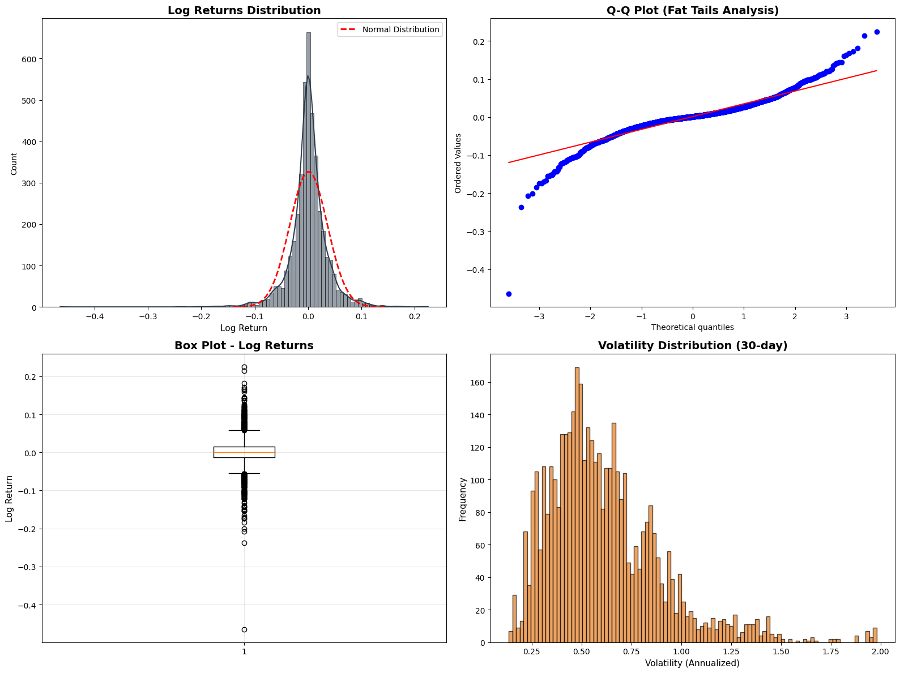
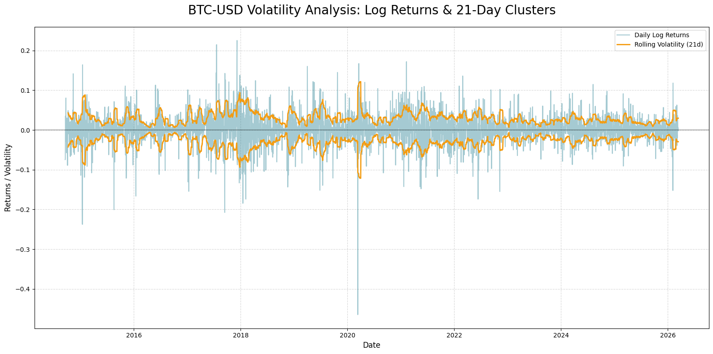
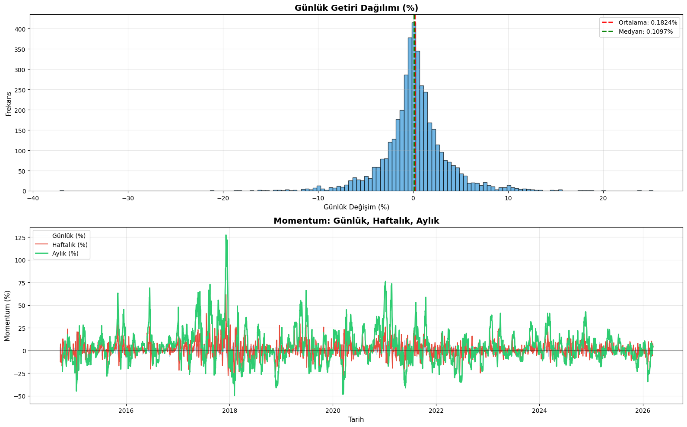
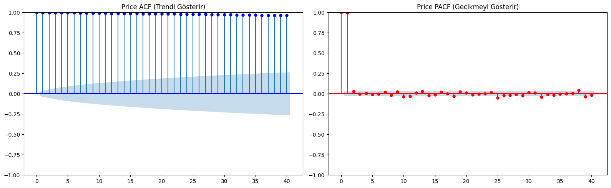
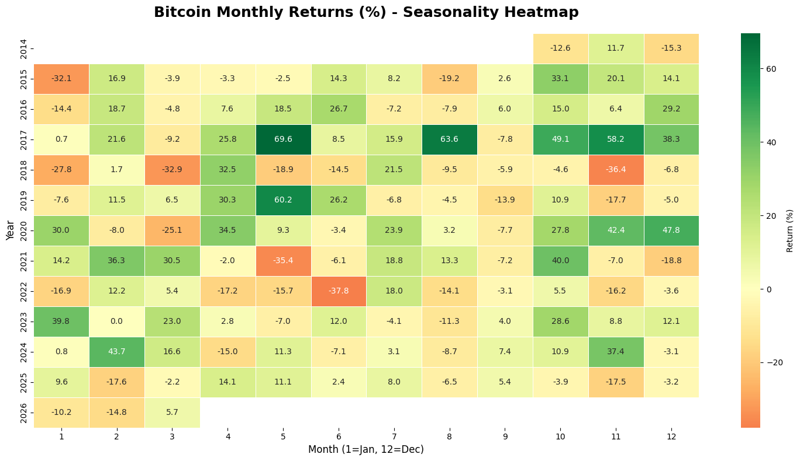
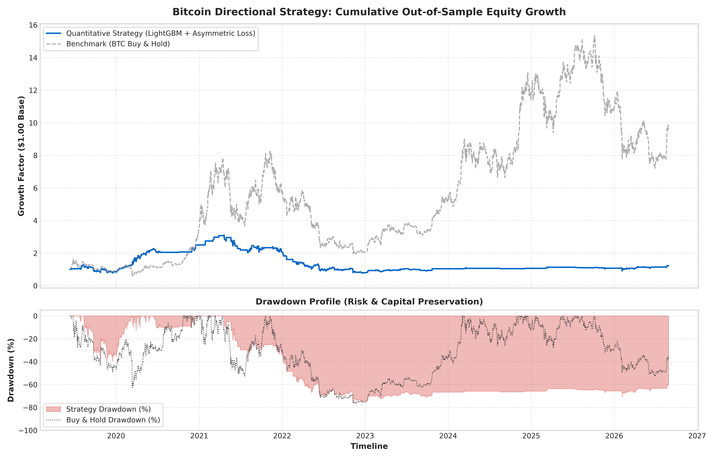
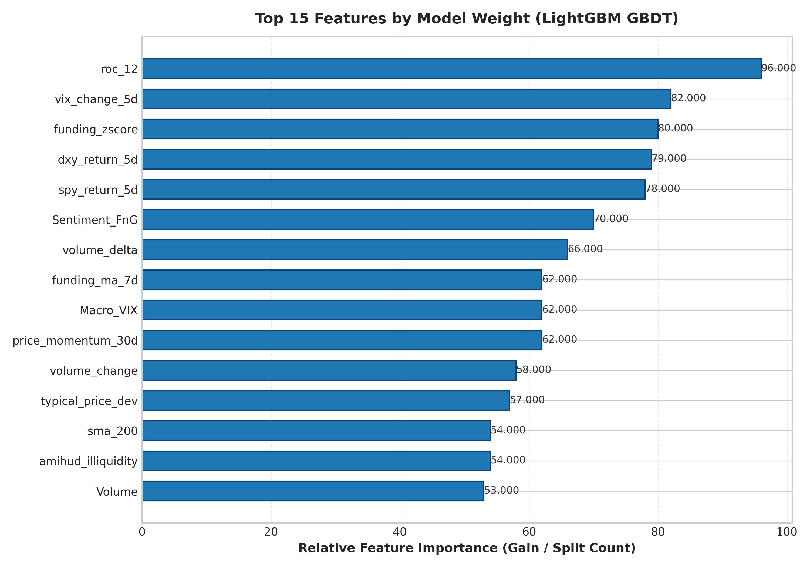

<div align="center">


<br><br>

# Quantitative Bitcoin Directional Forecasting

### Return-Weighted LightGBM & Regime-Aware Machine Learning

<br>


<br><br>

<a href="#overview">Overview</a> · <a href="#research-question">Research Question</a> · <a href="#methodology">Methodology</a> · <a href="#exploratory-analysis">EDA</a> · <a href="#model-architecture">Architecture</a> · <a href="#results">Results</a> · <a href="#feature-analysis">Features</a> · <a href="#project-structure">Structure</a> · <a href="#getting-started">Getting Started</a>

</div>

<br>

---

## Overview

<div align="center">

> A research-oriented machine learning framework for predicting the next-day direction of Bitcoin using price, derivatives, macroeconomic and sentiment information.

</div>

This project investigates whether machine learning can extract useful directional information from Bitcoin markets while accounting for two important characteristics of financial time series:

1. **Large and uneven price movements**
2. **Changing market conditions**

The framework combines a **LightGBM directional model**, a **return-weighted asymmetric training objective**, and a **3-state Gaussian Hidden Markov Model (HMM)** for market regime detection.

Unlike a standard random train/test split, the project uses **expanding walk-forward validation**, where every prediction is generated using information that would have been available at that point in time.

The final strategy is also evaluated with **transaction costs and slippage** rather than assuming frictionless trading.

<br>

<div align="center">

<table>
<tr>
<th align="center" width="25%">Prediction Target</th>
<th align="center" width="25%">Feature Set</th>
<th align="center" width="25%">Validation</th>
<th align="center" width="25%">Market Period</th>
</tr>

<tr>
<td valign="top" align="center">
Next-day BTC direction
</td>

<td valign="top" align="center">
52 engineered features
</td>

<td valign="top" align="center">
5 expanding walk-forward folds
</td>

<td valign="top" align="center">
2018–2026
</td>

</tr>
</table>

</div>

<br>

<div align="center">

<table>
<tr>

<td align="center" width="25%">
<h3>52</h3>
<sub>Engineered features</sub>
</td>

<td align="center" width="25%">
<h3>3</h3>
<sub>HMM market states</sub>
</td>

<td align="center" width="25%">
<h3>5-Fold</h3>
<sub>Walk-forward validation</sub>
</td>

<td align="center" width="25%">
<h3>572</h3>
<sub>Executed trades</sub>
</td>

</tr>
</table>

</div>

<br>

---

## Research Question

The central question of the project is:

> **Can a machine learning model identify useful next-day directional information in Bitcoin returns when training is adapted to large price movements, changing market regimes, and realistic trading costs?**

The project does not assume that a model with high classification accuracy will automatically produce a profitable strategy.

Instead, it evaluates the problem from two separate perspectives:

### Prediction Quality

* Accuracy
* Balanced Accuracy
* F1 Score
* ROC-AUC
* Log-Loss
* Brier Score

### Trading Performance

* Cumulative Return
* CAGR
* Annualized Volatility
* Sharpe Ratio
* Maximum Drawdown
* Number of Trades
* Transaction Costs

This separation is important because **statistical prediction performance and financial performance are not the same thing**.

---

## Methodology

<sub>From raw market data to out-of-sample directional forecasts</sub>

### 1. Data Preparation

The dataset combines information from several market sources:

* BTC spot OHLCV data
* Derivatives funding information
* Macro market indicators
* Equity market information
* Volatility indicators
* Investor sentiment

The data is aligned to a common daily timeline before feature construction.

---

### 2. Exploratory Data Analysis

Before modeling, the Bitcoin return series is examined for:

* Distribution shape
* Extreme observations
* Volatility clustering
* Autocorrelation
* Stationarity
* Momentum
* Seasonality

The purpose is to understand the statistical structure of the data before selecting the modeling approach.

---

### 3. Feature Engineering

A total of **52 features** are created from price, derivatives, macroeconomic and sentiment information.

Examples include:

* Multi-horizon returns
* Momentum measures
* Rolling volatility
* Funding-rate statistics
* Dollar index movements
* VIX movements
* Equity-market returns
* Liquidity measures
* Fear & Greed sentiment

All transformations are constructed in a way that prevents future information from entering the prediction period.

---

### 4. Return-Weighted Training

Ordinary classification treats observations with similar importance.

This project instead gives more weight to observations associated with larger realized next-day returns.

The purpose is simple:

> A wrong prediction during a major market move should matter more to the model than a wrong prediction during an almost flat trading day.

An additional penalty is applied to false-positive long signals on negative-return days.

---

### 5. Market Regime Detection

A **Gaussian Hidden Markov Model** identifies three broad market conditions:

<table>
<tr>
<th align="center">State</th>
<th align="center">Interpretation</th>
</tr>

<tr>
<td align="center"><b>0</b></td>
<td align="center">Bear / Liquidation</td>
</tr>

<tr>
<td align="center"><b>1</b></td>
<td align="center">Range / Whipsaw</td>
</tr>

<tr>
<td align="center"><b>2</b></td>
<td align="center">Bull / Expansion</td>
</tr>

</table>

The HMM is fitted separately inside each training window.

This prevents future market observations from influencing historical regime estimates.

---

### 6. Directional Modeling

The main predictive model is **LightGBM**, a gradient boosting decision tree algorithm.

The model estimates the probability of an upward move for the next trading day.

The predicted probability is then combined with the market regime information before the trading decision is made.

---

### 7. Walk-Forward Validation

The entire modeling process follows an expanding historical window.

```text
Training Window 1 ───────────────► Test 1

Training Window 1 + Test 1 ─────► Test 2

Training Window 1 + Test 1 + Test 2 ───► Test 3

...

All available historical data ───► Test 5
```

At no point is future test information used to train the model.

---

### 8. Backtesting

The resulting signals are evaluated through a trading simulation.

The backtest includes:

* Long/short signal logic
* Position changes
* Commission
* Slippage
* Portfolio returns
* Equity curve
* Drawdown

The assumed execution friction is **0.08% per trade**.

---

## Exploratory Analysis

The exploratory analysis provides the statistical motivation for the modeling choices.

<div align="center">

<table>
<tr>

<td width="50%" align="center" valign="top">

<br>

<b>Return Distribution & Fat Tails</b>

<br><br>



<br><br>

<sub>
Q-Q diagnostics showing the deviation of Bitcoin returns from a normal distribution.
</sub>

</td>

<td width="50%" align="center" valign="top">

<br>

<b>Volatility Clustering</b>

<br><br>



<br><br>

<sub>
Rolling volatility behavior showing persistent changes in market risk.
</sub>

</td>

</tr>

<tr>

<td width="50%" align="center" valign="top">

<br>

<b>Momentum & Return Distribution</b>

<br><br>



<br><br>

<sub>
Multi-horizon momentum behavior and empirical return distributions.
</sub>

</td>

<td width="50%" align="center" valign="top">

<br>

<b>ACF / PACF & Stationarity</b>

<br><br>



<br><br>

<sub>
Autocorrelation structure of the transformed return series.
</sub>

</td>

</tr>

<tr>

<td width="50%" align="center" valign="top">

<br>

<b>Seasonality</b>

<br><br>



<br><br>

<sub>
Monthly return behavior across different years.
</sub>

</td>

<td width="50%" align="center" valign="top">

<br>

<b>Equity Curve & Drawdown</b>

<br><br>



<br><br>

<sub>
Out-of-sample strategy performance and portfolio drawdown.
</sub>

</td>

</tr>

</table>

</div>

---

## Model Architecture

<div align="center">

<div align="center">

<table>
<tr>
<td align="center" colspan="2">

<b>01 · DATA SOURCES</b>
<br>
<sub>Market, derivatives, macro and sentiment information</sub>

<br><br>

BTC OHLCV &nbsp;•&nbsp; Funding Rates &nbsp;•&nbsp; DXY / VIX / SPY &nbsp;•&nbsp; Fear & Greed

</td>
</tr>

<tr>
<td align="center" colspan="2">
<br>
▼
<br>
</td>
</tr>

<tr>
<td align="center" colspan="2">

<b>02 · FEATURE ENGINEERING</b>
<br>
<sub>Transformation of raw inputs into model-ready predictors</sub>

<br><br>

<b>52 Engineered Features</b>
<br>
<sub>Returns · Momentum · Volatility · Liquidity · Derivatives · Macro · Sentiment</sub>

</td>
</tr>

<tr>
<td align="center" colspan="2">
<br>
▼
<br>
</td>
</tr>

<tr>
<td align="center" colspan="2">

<b>03 · WALK-FORWARD VALIDATION</b>
<br>
<sub>Time-aware training and out-of-sample evaluation</sub>

<br><br>

<b>5 Expanding Folds</b>
<br>
<sub>No random train/test split · No future information</sub>

</td>
</tr>

<tr>
<td align="center" colspan="2">
<br>
▼
<br>
</td>
</tr>

<tr>

<td align="center" width="50%" valign="top">

<b>04A · DIRECTION MODEL</b>

<br><br>

<b>LightGBM</b>
<br>
<sub>Gradient Boosting</sub>

<br><br>

Return-Weighted<br>
Asymmetric Objective

</td>

<td align="center" width="50%" valign="top">

<b>04B · REGIME MODEL</b>

<br><br>

<b>Gaussian HMM</b>
<br>
<sub>Hidden Markov Model</sub>

<br><br>

3 Market States<br>
<sub>Bear · Range · Bull</sub>

</td>

</tr>

<tr>
<td align="center" colspan="2">
<br>
▼
<br>
</td>
</tr>

<tr>
<td align="center" colspan="2">

<b>05 · SIGNAL & REGIME INTEGRATION</b>
<br>
<sub>Directional probability combined with market-state information</sub>

</td>
</tr>

<tr>
<td align="center" colspan="2">
<br>
▼
<br>
</td>
</tr>

<tr>
<td align="center" colspan="2">

<b>06 · BACKTEST ENGINE</b>
<br>
<sub>Historical strategy simulation</sub>

<br><br>

<b>Commission + Slippage</b>
<br>
<sub>0.08% execution friction per trade</sub>

</td>
</tr>

</table>

</div>

</div>

---

## Mathematical Framework

### Return-Weighted Asymmetric Objective

For each observation, the training weight is based on the absolute magnitude of the realized next-day return:

$$
w_i =
\left(
\frac{|R_{t+1}|}
{\frac{1}{N}\sum_{j=1}^{N}|R_j|}
\right)
\times
\left[
1 + (\lambda-1)\mathbb{I}_{\{y_i=0\}}
\right]
$$

where:

| Symbol    | Meaning                         |
| :-------- | :------------------------------ |
| $R_{t+1}$ | Realized next-day return        |
| $N$       | Number of training observations |
| $\lambda$ | Asymmetric penalty factor       |
| $y_i$     | Directional class               |

The project uses:

$$
\lambda = 1.5
$$

This means larger market movements receive greater influence during training, while false-positive long signals on negative-return observations receive an additional penalty.

The objective is not to make the model "predict volatility", but to make the training process more closely reflect the economic importance of different observations.

---

## Results

### Walk-Forward Cross-Validation

The following results are generated from the five expanding out-of-sample folds.

<table>
<tr>
<th align="center">Fold</th>
<th>Market Phase</th>
<th align="center">Accuracy</th>
<th align="center">Balanced Acc.</th>
<th align="center">F1</th>
<th align="center">ROC-AUC</th>
<th align="center">Log-Loss</th>
<th align="center">Brier</th>
</tr>

<tr>
<td align="center"><b>1</b></td>
<td>Bear Market & COVID Shock</td>
<td align="center">50.66%</td>
<td align="center">50.45%</td>
<td align="center">0.5374</td>
<td align="center"><b>0.5089</b></td>
<td align="center">0.7901</td>
<td align="center">0.2895</td>
</tr>

<tr>
<td align="center"><b>2</b></td>
<td>Post-Halving Expansion</td>
<td align="center">52.56%</td>
<td align="center">51.50%</td>
<td align="center">0.6585</td>
<td align="center"><b>0.5351</b></td>
<td align="center">0.7495</td>
<td align="center">0.2738</td>
</tr>

<tr>
<td align="center"><b>3</b></td>
<td>Institutional Inflow Rally</td>
<td align="center">50.66%</td>
<td align="center">51.36%</td>
<td align="center">0.5273</td>
<td align="center"><b>0.5351</b></td>
<td align="center">0.7360</td>
<td align="center">0.2682</td>
</tr>

<tr>
<td align="center"><b>4</b></td>
<td>Fed Tightening & Crypto Deleveraging</td>
<td align="center">49.72%</td>
<td align="center">51.85%</td>
<td align="center">0.1745</td>
<td align="center"><b>0.5611</b></td>
<td align="center">0.7868</td>
<td align="center">0.2898</td>
</tr>

<tr>
<td align="center"><b>5</b></td>
<td>Spot ETF Era & Maturing Liquidity</td>
<td align="center">49.72%</td>
<td align="center">49.77%</td>
<td align="center">0.2700</td>
<td align="center"><b>0.5232</b></td>
<td align="center">0.7196</td>
<td align="center">0.2625</td>
</tr>

<tr>
<td align="center"><b>Mean</b></td>
<td><b>2018–2026 Aggregate</b></td>
<td align="center"><b>50.66%</b></td>
<td align="center"><b>50.99%</b></td>
<td align="center"><b>0.4335</b></td>
<td align="center"><b>0.5327</b></td>
<td align="center"><b>0.7564</b></td>
<td align="center"><b>0.2768</b></td>
</tr>

</table>

<br>

<div align="center">

<table>
<tr>

<td align="center" width="25%">
<h3>50.66%</h3>
<sub>Mean Accuracy</sub>
</td>

<td align="center" width="25%">
<h3>50.99%</h3>
<sub>Balanced Accuracy</sub>
</td>

<td align="center" width="25%">
<h3>0.5327</h3>
<sub>Mean ROC-AUC</sub>
</td>

<td align="center" width="25%">
<h3>0.2768</h3>
<sub>Brier Score</sub>
</td>

</tr>
</table>

</div>

### What Do These Results Mean?

The classification results show that **next-day Bitcoin direction is difficult to predict consistently**.

Average accuracy remains close to 50%, meaning the model does not provide strong directional classification performance by itself.

However, ROC-AUC remains above 0.50 across all five folds, suggesting that the model contains some information about the relative likelihood of upward and downward outcomes.

This distinction is important:

> The model should not be interpreted as a high-accuracy Bitcoin direction predictor. The main research interest is whether relatively weak predictive information can still be used to construct a different risk-return profile.

---

## Strategy Backtest

The trading strategy is compared with a passive BTC Buy & Hold benchmark.

<table>
<tr>
<th>Performance Metric</th>
<th align="center">Strategy</th>
<th align="center">BTC Buy & Hold</th>
</tr>

<tr>
<td><b>Total Cumulative Return</b></td>
<td align="center"><b>+186.33%</b></td>
<td align="center">+857.79%</td>
</tr>

<tr>
<td><b>Annualized Return (CAGR)</b></td>
<td align="center"><b>+15.69%</b></td>
<td align="center">+36.21%</td>
</tr>

<tr>
<td><b>Annualized Volatility</b></td>
<td align="center"><b>45.91%</b></td>
<td align="center">68.45%</td>
</tr>

<tr>
<td><b>Sharpe Ratio (365d)</b></td>
<td align="center"><b>0.55</b></td>
<td align="center">0.53</td>
</tr>

<tr>
<td><b>Maximum Drawdown</b></td>
<td align="center"><b>-55.44%</b></td>
<td align="center">-77.40%</td>
</tr>

<tr>
<td><b>Executed Trades</b></td>
<td align="center">572</td>
<td align="center">1</td>
</tr>

<tr>
<td><b>Execution Friction</b></td>
<td align="center">0.08%</td>
<td align="center">0.00%</td>
</tr>

</table>

<br>

<div align="center">

<table>
<tr>

<td align="center" width="33%">
<h3>+15.69%</h3>
<sub>Strategy CAGR</sub>
</td>

<td align="center" width="33%">
<h3>0.55</h3>
<sub>Strategy Sharpe</sub>
</td>

<td align="center" width="33%">
<h3>-55.44%</h3>
<sub>Maximum Drawdown</sub>
</td>

</tr>
</table>

</div>

### Performance Interpretation

The strategy **does not outperform Buy & Hold in total return or CAGR** during the tested period.

Its main difference is in risk characteristics:

* Lower annualized volatility
* Lower maximum drawdown
* Slightly higher Sharpe ratio in this backtest

Therefore, the result should not be presented as a system that "beats Bitcoin".

A more accurate interpretation is that the model produces a **lower-return, lower-volatility alternative to passive BTC exposure** during the tested period.

---

## Feature Analysis

The LightGBM model provides feature importance measures that help identify which variables contribute most to its predictions.

<div align="center">



<br><br>

<sub>
Top features ranked by LightGBM split gain.
</sub>

</div>

<br>

### Main Feature Groups

<table>
<tr>
<th width="25%">Feature Group</th>
<th>Examples</th>
<th>Role</th>
</tr>

<tr>
<td><b>Macro & Risk</b></td>
<td><code>vix_change_5d</code>, <code>Macro_VIX</code>, <code>dxy_return_5d</code>, <code>spy_return_5d</code></td>
<td>Capture changes in broader market risk and liquidity conditions.</td>
</tr>

<tr>
<td><b>Derivatives</b></td>
<td><code>funding_zscore</code></td>
<td>Capture changes in futures positioning and leverage.</td>
</tr>

<tr>
<td><b>Liquidity</b></td>
<td><code>amihud_illiquidity</code></td>
<td>Measure changes in market liquidity and trading conditions.</td>
</tr>

<tr>
<td><b>Sentiment</b></td>
<td><code>Sentiment_FnG</code></td>
<td>Provide information about investor sentiment and market stress.</td>
</tr>

</table>

The feature analysis suggests that the model does not depend only on Bitcoin's own price history.

Information from **macro markets, derivatives, liquidity and sentiment** also contributes to the model's decisions.

---

## Data Leakage Control

Avoiding look-ahead bias is one of the main design requirements of this project.

The framework therefore follows several rules:

<table>
<tr>
<th>Control</th>
<th>Implementation</th>
</tr>

<tr>
<td><b>Temporal Validation</b></td>
<td>Expanding walk-forward validation instead of random train/test splitting.</td>
</tr>

<tr>
<td><b>Feature Construction</b></td>
<td>Features use only information available before the prediction period.</td>
</tr>

<tr>
<td><b>HMM Training</b></td>
<td>Market regimes are estimated only from the corresponding training window.</td>
</tr>

<tr>
<td><b>Out-of-Sample Predictions</b></td>
<td>Each reported prediction comes from a model that has not seen that future period.</td>
</tr>

<tr>
<td><b>Trading Costs</b></td>
<td>Commission and slippage are included in the strategy backtest.</td>
</tr>

</table>

The goal is not to guarantee that the strategy will perform similarly in live markets, but to make the historical evaluation more realistic.

---

## Project Structure

> *This section is collapsed by default. Click below to view the complete repository structure.*

<details>
<summary><b>Show full directory tree</b></summary>

<br>

```text
BTC_Financial_Econometrics/
│
├── data/
│   └── raw/
│       └── btc_dataset_raw.csv
│
├── notebooks/
│   └── Exploratory research and prototype development
│
├── reports/
│   └── figures/
│       ├── 01_distribution_and_momentum.png
│       ├── 02_volatility_clustering.png
│       ├── 03_acf_pacf_stationarity.png
│       ├── 04_fat_tails_qq_plot.png
│       ├── 05_seasonality_heatmap.png
│       ├── 06_equity_curve_and_drawdown.png
│       └── 07_feature_importance.png
│
├── results/
│   ├── summary_report.md
│   ├── summary.json
│   └── fold_metrics.csv
│
├── src/
│   ├── __init__.py
│   ├── backtest.py
│   ├── data_loader.py
│   ├── models.py
│   ├── pipeline.py
│   ├── preprocessing.py
│   └── visualization.py
│
├── tests/
│   └── Unit tests
│
├── main.py
├── requirements.txt
└── README.md
```

</details>

<br>

---

## Tech Stack & Ecosystem

<table>

<tr>
<td width="25%"><b>Category</b></td>
<td><b>Technologies</b></td>
</tr>

<tr>
<td><b>Core Language</b></td>
<td>

</td>
</tr>

<tr>
<td><b>Data Processing</b></td>
<td>


</td>
</tr>

<tr>
<td><b>Machine Learning</b></td>
<td>


</td>
</tr>

<tr>
<td><b>Regime Detection</b></td>
<td>

</td>
</tr>

<tr>
<td><b>Visualization</b></td>
<td>

</td>
</tr>

<tr>
<td><b>Research Workflow</b></td>
<td>


</td>
</tr>

</table>

---

## Getting Started

### 1. Clone the Repository

```bash
git clone https://github.com/muhammedsaylik/btc-regime-forecasting.git

cd btc-regime-forecasting
```

### 2. Create a Virtual Environment

**Windows**

```bash
python -m venv .venv
.venv\Scripts\activate
```

**Linux / macOS**

```bash
python -m venv .venv
source .venv/bin/activate
```

### 3. Install Dependencies

```bash
pip install -r requirements.txt
```

### 4. Run the Primary Model

```bash
python main.py --model-type lightgbm --threshold-long 0.53 --threshold-short 0.00
```

### 5. Run the Ensemble Configuration

```bash
python main.py --ensemble --threshold-long 0.53 --threshold-short 0.00
```

The pipeline generates model results, validation metrics and research figures.

---

## Results & Output Files

After execution, the main outputs are stored in the `results/` and `reports/` directories.

<table>
<tr>
<th>File</th>
<th>Purpose</th>
</tr>

<tr>
<td><code>results/summary_report.md</code></td>
<td>Human-readable summary of the experiment.</td>
</tr>

<tr>
<td><code>results/summary.json</code></td>
<td>Machine-readable model and backtest metrics.</td>
</tr>

<tr>
<td><code>results/fold_metrics.csv</code></td>
<td>Performance metrics for each walk-forward fold.</td>
</tr>

<tr>
<td><code>reports/figures/</code></td>
<td>EDA, model and backtest visualizations.</td>
</tr>

</table>

---

## Limitations

The results should be interpreted within the limits of the current experiment.

### 1. Directional Prediction Remains Difficult

Average accuracy is close to 50%, indicating that the model does not provide a strong standalone directional edge.

### 2. Buy & Hold Produces Higher Returns

The tested strategy generates substantially lower cumulative return and CAGR than passive BTC exposure.

### 3. Historical Results Are Not Future Results

The model was evaluated on historical data. Future market structure, liquidity and volatility can differ from the tested period.

### 4. Transaction Costs Matter

The strategy executes 572 trades, making execution assumptions important to the final result.

### 5. Model and Feature Choices Matter

Results depend on the selected features, thresholds, HMM structure, LightGBM configuration and validation period.

---

## Future Work

Potential extensions of the framework include:

* Probability calibration
* Regime-specific predictive models
* Alternative loss functions
* GARCH-based volatility modeling
* Additional ensemble methods
* Feature selection and dimensionality reduction
* More detailed transaction-cost models
* Hyperparameter optimization inside walk-forward folds
* Longer out-of-sample periods
* Cross-asset validation using other cryptocurrencies
* Comparison with statistical forecasting models such as ARIMA and GARCH

---

## Conclusion

This project investigates a difficult problem: **whether machine learning can extract useful directional information from Bitcoin while respecting the time-dependent nature of financial data.**

The results do not show that the model can consistently predict Bitcoin direction with high accuracy or outperform Buy & Hold.

Instead, the experiment provides evidence that:

* Bitcoin returns contain strong non-normal behavior and changing volatility.
* Market conditions can be represented using latent regime information.
* Macro, derivatives, liquidity and sentiment variables can contribute to directional modeling.
* Strict walk-forward validation produces a much more demanding test than random train/test splitting.
* A strategy can produce lower volatility and lower drawdown while sacrificing a substantial amount of return.

The main value of the project is therefore the **research framework and evaluation process**, rather than a claim of superior trading performance.

---

## Disclaimer

This project is intended for **research and educational purposes only**.

Historical backtest results do not guarantee future performance. Cryptocurrency markets are highly volatile, and real-world execution may differ substantially from historical simulations.

Nothing in this repository should be interpreted as financial advice or a recommendation to buy, sell or trade Bitcoin.

---

<div align="center">

### Quantitative Bitcoin Directional Forecasting

<sub>Research project focused on financial time series, machine learning and out-of-sample evaluation.</sub>

<br><br>


</div>
